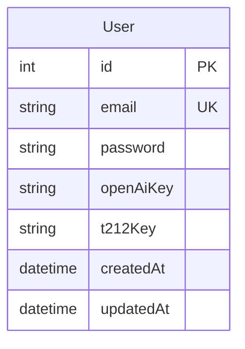

# Database Schema

## Entity Relationship Diagram

## Table: users

The main user table storing authentication and API key information.

### Columns

| Column | Type | Constraints | Description |
|--------|------|-------------|-------------|
| id | SERIAL | PRIMARY KEY | Auto-incrementing user ID |
| email | TEXT | NOT NULL, UNIQUE | User's email address (login identifier) |
| password | TEXT | NOT NULL | Bcrypt hashed password |
| openAiKey | TEXT | NULL | Optional OpenAI API key for user |
| t212Key | TEXT | NULL | Optional Trading 212 API key for user |
| createdAt | TIMESTAMP(3) | NOT NULL, DEFAULT NOW() | Record creation timestamp |
| updatedAt | TIMESTAMP(3) | NOT NULL | Record last update timestamp |

### Indexes

- `users_email_key`: Unique index on email column
- `users_pkey`: Primary key index on id column

### Business Rules

1. **Email Uniqueness**: Each email can only be registered once
2. **Password Security**: Passwords are hashed using bcrypt with salt rounds of 12
3. **API Keys**: Both OpenAI and Trading 212 keys are optional and can be added/updated after registration
4. **Timestamps**: Automatically managed by Prisma for audit purposes

### Future Extensions

This schema is designed to be extensible. Potential future additions:

1. **User Profiles**: Add profile information (name, preferences, etc.)
2. **Sessions**: Add session management table for better security
3. **API Key Encryption**: Encrypt stored API keys at rest
4. **User Roles**: Add role-based access control
5. **Trading History**: Add tables for tracking user's trading decisions and performance
6. **Advisor Settings**: Add table for user-specific advisor configurations
